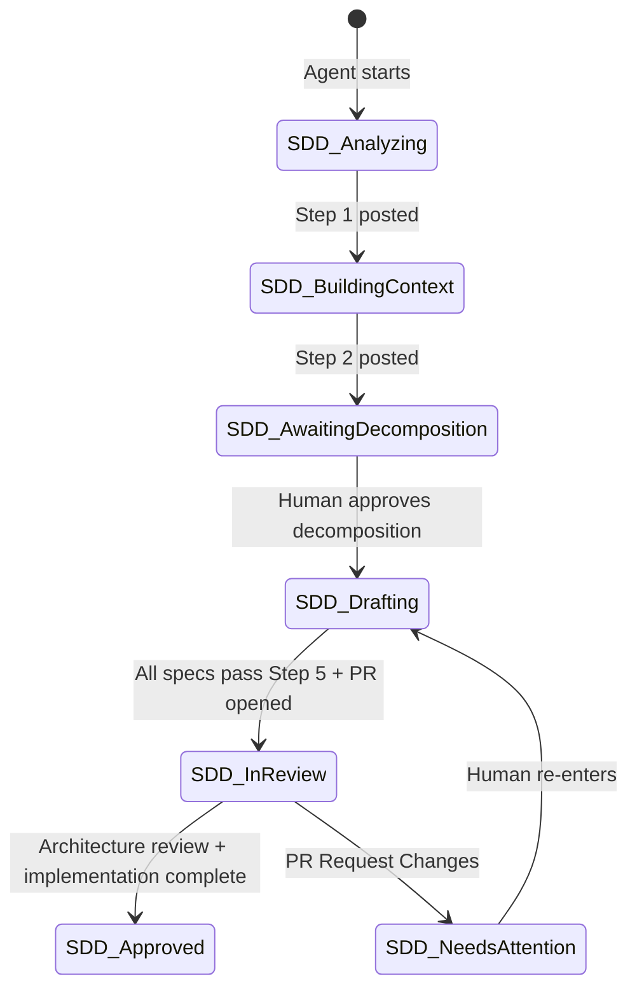

# Milkful — Specification Driven Design (SDD)

This repo implements the **Specification Driven Design** workflow for the Milkful platform,
adapted from the `spec-driven-designer` skill (see [`milkful2026/milkful-app` → `docs/design/agent-screenshot/`](https://github.com/milkful2026/milkful-app/tree/main/docs/design/agent-screenshot)).

The SDD agent instructions live in [`milkful2026/milkful-app` → `docs/design/agent/spec-driven-designer.md`](https://github.com/milkful2026/milkful-app/blob/main/docs/design/agent/spec-driven-designer.md).

| Platform | Jira Epic | Area folder | Stack |
|----------|-----------|-------------|-------|
| Flutter mobile app | [MA-18](https://milkfuldairyindia.atlassian.net/browse/MA-18) | `mobile-app/` | Flutter (iOS & Android) |
| AWS backend services | [MA-19](https://milkfuldairyindia.atlassian.net/browse/MA-19) | `services/` | API Gateway, Lambda, Fargate, Aurora, Cognito, EventBridge |
| React admin console | [MA-20](https://milkfuldairyindia.atlassian.net/browse/MA-20) | `portal-ui/` | React, TypeScript |

**Jira board:** [MA Backlog](https://milkfuldairyindia.atlassian.net/jira/software/projects/MA/boards/1/backlog)

---

## SDD workflow (5 steps)



### Step 1 — Analyze User Story

Read the Jira story (summary, description, acceptance criteria, comments, attachments).
Post `SDD-ANALYSIS` comment. Transition story → **SDD: Building Context**.

### Step 2 — Build Technical Context

Load area READMEs, architecture docs, and prior specs. Post `SDD-CONTEXT` comment.
Transition story → **SDD: Awaiting Decomposition**.

### Step 3 — Propose Specification Decomposition

Post `SDD-DECOMPOSITION-PROPOSAL` with ✓ (confident) and ⚠ (flagged) specs.
Transition story → **SDD: Awaiting Decomposition**. **Halt** until human moves to **SDD: Drafting**.

### Step 4 — Create Specifications

For each approved spec:

1. Create Jira Task: `SDD: {STORY-KEY} - {Spec Title}`
2. Link: User Story **specifies** Task
3. Write spec file at `{area}/tasks/MA/{STORY-KEY}/{SPEC-KEY}.md`
4. Commit on branch `spec/{STORY-KEY}`, push, update Task description with spec URL

### Step 5 — Review and Align

Run individual + cross-spec checklists. If all pass → open PR, transition Tasks → **Spec: In Review**, Story → **SDD: In Review**.

---

## Repository layout

```
./
├── README.md                          ← this file
├── mobile-app/README.md               ← Flutter SDD context
├── services/README.md                 ← AWS microservices SDD context
├── portal-ui/README.md                ← React admin SDD context
└── {STORY-KEY}/                       ← workflow artifacts per story
    ├── step1-analysis.md
    ├── step2-context.md
    ├── step3-decomposition.md
    ├── step5-review.md
    └── dry-run-report.md

{area}/tasks/MA/{STORY-KEY}/{SPEC-KEY}.md   ← individual specifications
```

---

## Jira story map (mobile ↔ backend ↔ admin)

| Mobile Story | Feature | Backend services (blocks) | Admin (related) |
|--------------|---------|---------------------------|-----------------|
| MA-1 | User Registration | MA-92 Auth, MA-93 User, MA-95 Inventory, MA-100 Wallet | MA-39 User Management |
| MA-21 | User Login | MA-92, MA-93 | MA-39 |
| MA-22 | Product Listing | MA-94 Catalog, MA-95 Inventory | MA-42 Catalog |
| MA-23 | Add to Cart | MA-96 Cart, MA-95, MA-101 Pricing | — |
| MA-24 | Payment Gateway | MA-99 Payment, MA-100 Wallet | MA-40 Transactions |
| MA-25 | Subscription | MA-98, MA-97 Order, MA-100 | MA-43 Orders/Subs |

Full mapping: `scripts/link-backend-mobile-jira.py`, `scripts/link-admin-backend-jira.py`.

---

## Pilot story

**[MA-1 User Registration](https://milkfuldairyindia.atlassian.net/browse/MA-1)** — full SDD package:

- Workflow: `MA-1/`
- Specs:
  - `mobile-app/tasks/MA/MA-1/flutter-registration-onboarding.md`
  - `services/tasks/MA/MA-1/identity-auth-registration.md`
  - `services/tasks/MA/MA-1/user-registration-api.md`
  - `services/tasks/MA/MA-1/inventory-serviceability-api.md`
  - `services/tasks/MA/MA-1/wallet-auto-provision.md`

---

## Tools (when live SDD is run)

| Tool | Purpose |
|------|---------|
| `acli jira workitem …` | Read/update Jira stories and tasks |
| `git` | Commit spec files (this repo only — source repos are read-only) |
| `gh pr create` | Open spec PR for review, targeting `milkful2026/specs` |

**Dry-run mode:** write outputs locally under `~/sdd-tmp/`; skip Jira/Git writes.

**Reference:** [`milkful2026/milkful-app` → `docs/design/agent-screenshot/`](https://github.com/milkful2026/milkful-app/tree/main/docs/design/agent-screenshot) (spec-driven-designer skill screenshots) and [`docs/design/agent/spec-driven-designer.md`](https://github.com/milkful2026/milkful-app/blob/main/docs/design/agent/spec-driven-designer.md) (full agent instructions).
