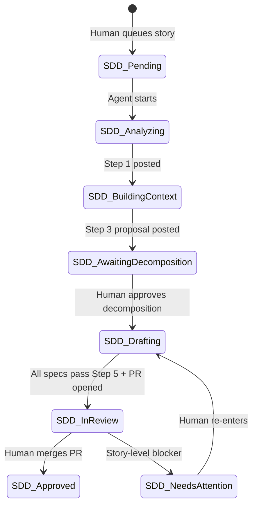

# Specs Repository

This repository is the single source of truth for all **Specification Driven Design (SDD)** artifacts for the Milkful platform. Every feature, change, or enhancement that enters development first passes through a structured specification workflow — this repo is where those specifications live, are reviewed, and are approved.

The agent that produces them — the `spec-driven-designer` skill — lives in
[`milkful2026/agentic-engineering` → `skills/spec-driven-designer.md`](https://github.com/milkful2026/agentic-engineering/blob/main/skills/spec-driven-designer.md).

| Platform | Jira Epic | Area folder | Stack |
|----------|-----------|-------------|-------|
| Flutter mobile app | MA-18 | `mobile-app/` | Flutter (iOS & Android) |
| AWS backend services | MA-19 | `services/` | API Gateway, Lambda, Fargate, Aurora, Cognito, EventBridge |
| React admin console | MA-20 | `portal-ui/` | React, TypeScript |

**Jira board:** [MA Backlog](https://milkfuldairyindia.atlassian.net/jira/software/projects/MA/boards/1/backlog)

---

## What Is Specification Driven Design?

Specification Driven Design ensures engineers never begin coding from implied requirements, verbal direction, or incomplete understanding. Before implementation starts, a business-analyst agent analyzes the User Story, builds technical context against Milkful architecture, and produces structured specification documents.

Each specification defines:

- **What will be built** — scope, functional requirements, and business rules
- **How it will behave** — technical design, data changes, integrations, and edge cases
- **How success will be validated** — acceptance criteria, testing strategy, and non-functional targets

The result is a reviewable, traceable artifact that engineers and business stakeholders can sign off on before any implementation begins.

---

## How Specifications Are Tracked

| System | Role |
|--------|------|
| **Jira** | Tracks business intent (User Stories) and specification status (Tasks); carries workflow transitions and review feedback |
| **This repository** | Stores specification files as versioned Markdown; the pull request is the human review and approval surface |

### Jira work items

**User Story** — written by a human; drives the SDD workflow from `SDD: Pending` through `SDD: Approved`.

**Task** — created by the agent, one per specification artifact. Holds the spec file URL, PR URL, and review status (`Spec: Drafting` → `Spec: In Review` → `Spec: Approved`).

Every Task links back to its parent User Story via `specifies` / `is specified by`.

### This repository

```
./
├── README.md                          ← this file
├── mobile-app/
│   ├── README.md                      ← SDD context (architect-maintained)
│   ├── docs/                          ← built-state docs (implementation agent)
│   └── tasks/MA/{STORY-KEY}/{SPEC-KEY}.md
├── services/
│   ├── README.md
│   ├── docs/
│   └── tasks/MA/{STORY-KEY}/{SPEC-KEY}.md
├── portal-ui/
│   ├── README.md
│   ├── docs/
│   └── tasks/MA/{STORY-KEY}/{SPEC-KEY}.md
└── {STORY-KEY}/                       ← optional dry-run / workflow scratch artifacts
    ├── step1-analysis.md
    ├── step2-context.md
    ├── step3-decomposition.md
    ├── step5-review.md
    └── dry-run-report.md
```

`{SPEC-KEY}` is the Jira Task key assigned when the Task is created — every file is directly traceable to a work item.

---

## The Lifecycle of a Specification

### User Story phases

| Phase | What it means |
|-------|---------------|
| `SDD: Pending` | Handed to SDD; not yet started |
| `SDD: Analyzing` | Agent extracting business intent, acceptance criteria, open questions |
| `SDD: Building Context` | Agent mapping systems, dependencies, constraints |
| `SDD: Awaiting Decomposition` | Decomposition proposed; waiting for human approval |
| `SDD: Drafting` | Spec files being written on the working branch |
| `SDD: In Review` | All specs passed quality review; PR open; awaiting human sign-off |
| `SDD: Approved` | Human merged the PR; implementation planning may begin |
| `SDD: Needs Attention` | Story-level blocker requiring a human decision |

### Individual specification phases

| Phase | What it means |
|-------|---------------|
| `Spec: Drafting` | Spec file is being written |
| `Spec: In Review` | Spec passed internal checks; PR open |
| `Spec: Needs Attention` | Failed checks or reviewer issues; revision required |
| `Spec: Approved` | Spec reviewed and approved by a human |

Sibling specs can be at different phases simultaneously.


```mermaid
stateDiagram-v2
    [*] --> SDD_Pending: Human queues story
    SDD_Pending --> SDD_Analyzing: Agent starts
    SDD_Analyzing --> SDD_BuildingContext: Step 1 posted
    SDD_BuildingContext --> SDD_AwaitingDecomposition: Step 3 proposal posted
    SDD_AwaitingDecomposition --> SDD_Drafting: Human approves decomposition
    SDD_Drafting --> SDD_InReview: All specs pass Step 5 + PR opened
    SDD_InReview --> SDD_Approved: Human merges PR
    SDD_InReview --> SDD_NeedsAttention: Story-level blocker
    SDD_NeedsAttention --> SDD_Drafting: Human re-enters
```

---

## What the Pull Request Represents

When all specifications for a User Story pass quality review, the agent opens **one pull request** on this repository. The PR:

- Contains all spec files for that story on branch `spec/{STORY-KEY}`
- Summarizes every specification with links to each file
- Directs review feedback to individual Jira Tasks (`SDD-FEEDBACK` is authoritative)
- Is the human approval action — merging signals the set is complete

The agent never merges or closes the PR.

---

## How to Give Feedback

### On a specification file (post-PR)

1. Open the Jira Task linked from the spec file or PR description.
2. Transition the Task to `Spec: Needs Attention`.
3. Post:

```
SDD-FEEDBACK
Issues:
  - [Section] Description of the issue
  - [Section] Description of the issue
Additional context: optional free text
```

The agent revises the file on the same branch and re-runs quality review. GitHub inline comments are welcome as context; the Jira `SDD-FEEDBACK` comment is what triggers revision.

### On the decomposition proposal (before drafting)

When the story is at `SDD: Awaiting Decomposition`:

1. Post `SDD-DECOMPOSITION-FEEDBACK`:

```
SDD-DECOMPOSITION-FEEDBACK
Accept: Spec Title, Spec Title
Remove: Spec Title — reason
Add: Spec Title — one-line scope description
Modify: Spec Title — updated scope description
```

2. Transition to `SDD: Drafting`.

To approve as-is, transition to `SDD: Drafting` with no comment.

---

## Branch and Commit Conventions

| Convention | Pattern |
|------------|---------|
| Branch per story | `spec/{STORY-KEY}` |
| Commit message | `spec({STORY-KEY}): {imperative summary}` |
| Revision commit | `spec({STORY-KEY}): revise {SPEC-KEY} — {what changed and why}` |

Commit history is the version record — there is no manual changelog.

---

## Area READMEs and Context Documents

### `{area}/README.md` — SDD context entry point

Architect-maintained. Declares the source repository, context doc paths, and a short area description. The SDD agent reads this during Session Initialization for every matching Jira Component. The agent never modifies it.

```markdown
# {Area Name} — SDD Context

**GitHub Repo:** {owner}/{repo}
**Context Docs:**
- {relative path to doc in source repo}

## Description
{Short description of this project area.}
```

### `{area}/docs/` — built-state documentation

Written by the **implementation agent** after features ship. Documents what was actually built — interfaces, decisions, limitations, patterns.

The **SDD agent reads these as Layer 2 context**. Empty at project start; skipped silently when empty.

---

## Jira story map (mobile ↔ backend ↔ admin)

| Mobile Story | Feature | Backend services (blocks) | Admin (related) |
|--------------|---------|---------------------------|-----------------|
| MA-1 | User Registration | MA-92 Auth, MA-93 User, MA-95 Inventory, MA-100 Wallet | MA-39 User Management |
| MA-21 | User Login | MA-92, MA-93 | MA-39 |
| MA-22 | Product Listing | MA-94 Catalog, MA-95 Inventory | MA-42 Catalog |
| MA-23 | Add to Cart | MA-96 Cart, MA-95, MA-101 Pricing | — |
| MA-24 | Payment Gateway | MA-99 Payment, MA-100 Wallet | MA-40 Transactions |
| MA-25 | Subscription | MA-98, MA-97 Order, MA-100 | MA-43 Orders/Subs |

Full mapping: `scripts/link-backend-mobile-jira.py`, `scripts/link-admin-backend-jira.py` (in `milkful-app`).

---

## Pilot story

**[MA-1 User Registration](https://milkfuldairyindia.atlassian.net/browse/MA-1)** — full SDD package:

- Workflow scratch: `MA-1/`
- Specs:
  - `mobile-app/tasks/MA/MA-1/flutter-registration-onboarding.md`
  - `services/tasks/MA/MA-1/identity-auth-registration.md`
  - `services/tasks/MA/MA-1/user-registration-api.md`
  - `services/tasks/MA/MA-1/inventory-serviceability-api.md`
  - `services/tasks/MA/MA-1/wallet-auto-provision.md`

---

## Tools (when live SDD is run)

| Tool | Purpose |
|------|---------|
| `acli jira workitem …` | Read/update Jira stories and tasks |
| `git` | Commit spec files (this repo only — source repos are read-only) |
| `gh pr create` | Open spec PR targeting `milkful2026/specs` |

**Dry-run mode:** write outputs under `~/sdd-tmp/`; skip Jira/Git writes.

**Agent instructions:** [`milkful2026/agentic-engineering` → `skills/spec-driven-designer.md`](https://github.com/milkful2026/agentic-engineering/blob/main/skills/spec-driven-designer.md).

---

## Quick Reference

| I want to… | Where to go |
|------------|-------------|
| See in-flight SDD work | Jira board — SDD columns |
| Read a specification | `{area}/tasks/MA/{STORY-KEY}/{SPEC-KEY}.md` |
| Review / approve a set | GitHub PR linked from each Task description |
| Give feedback on a spec | Jira Task → `SDD-FEEDBACK` + `Spec: Needs Attention` |
| Approve decomposition | User Story → `SDD: Drafting` |
| Why a spec changed | Git log on `spec/{STORY-KEY}` |
| Trace spec → business need | Task → `specifies` → User Story |
| Configure a new area | Create `{area}/README.md` + matching Jira Component |
| Architecture context for agents | `{area}/README.md` + `{area}/docs/` |
